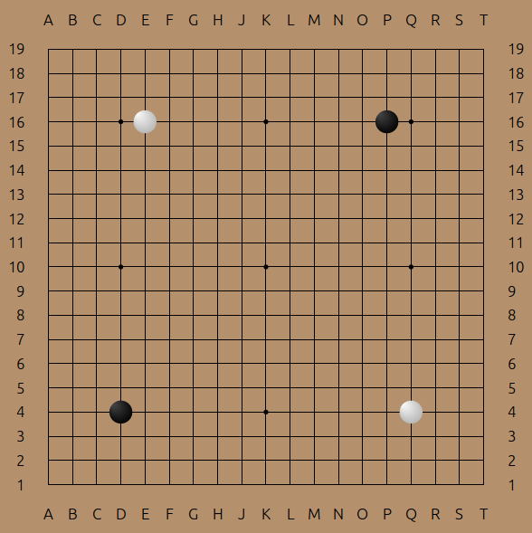

SVGoban
=======

*A lightweight JavaScript library that builds a Goban representation as a set of SVG shapes.*

## Project Guidelines

* Pure functions (no state, no side-effects)
* Scalable to any size without quality loss (SVG!)
* No dependencies
* Any goban size
* CSS styling
* Default themes with plain colors and very light gradients

## Demo

Generate a SVG sample output from this repository: `node demo/test_19classic_4stones.js > sample.svg`

## Usage

### Installation
SVGoban may be installed as a NPM package: `npm install svgoban --save`

